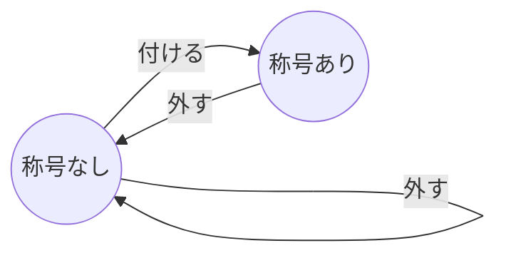
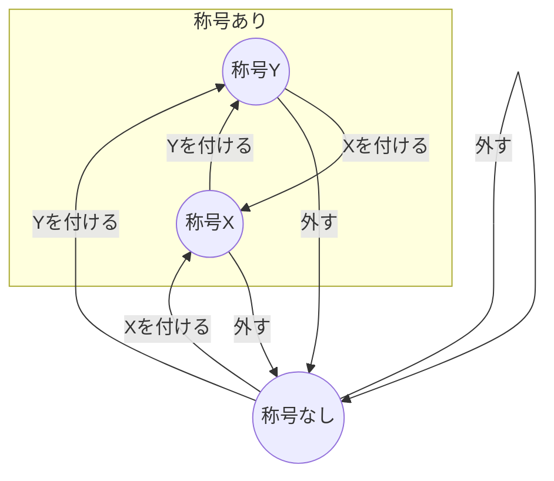

## はじめに

自動テストが叫ばれて10数年以上の時を経ていますが、今なお開発者の興味を惹くトピックの1つであります
実際、Developers Summit 2023ではテストを主題とした講演が多く、また人気も博したと耳にします
さて自動テストと共に話題になるトピックの1つと言えばテスト駆動開発でしょう
ただテスト駆動開発は、設計・開発手法のため自動テストとは厳密にはジャンル違いであり、誤解を受けがちなトピックでもあります
またテスト駆動開発を解説する書籍の多くが、Java等のオブジェクト指向言語のスタイルで書かれているためフロントエンドエンジニアのコードスタイルとは若干差異があリます
当記事ではフロントエンドエンジニアのためにテスト駆動開発の技法の数々をTypeScript、Reactを用いて実践します
フレームワークとしてReactを採用しましたが、記事内のコードはモダンフロントエンドフレームワーク全般に通じるように記述しております
また当記事のコードを用いたハンズオンも用意しております
テスト駆動開発は、実践を通じて学ぶことを数々のベテランエンジニアが推奨しております
ぜひご活用ください

https://github.com/mymactive/hands-on-tdd-with-react-typescript

## お題のストーリー

あなたはブログサービスの開発者です
ユーザーがより個性を表現できるように、称号を自称できる機能を遊び心から思いつきました
暇つぶし程度の思いつきでしたが、無事機能実装をできる段階まで漕ぎ着けました
称号は以下のような仕様であるとまとめました

1. ユーザーはいつでも称号を自称できる
2. ユーザーは称号を編集できる
3. ユーザーは称号を外すこともできる
4. 称号は簡単なテキストから構成される

## 設計

まずは実装の前に、設計を行うことに異論はないでしょう
ですが、そもそも設計とは何でしょうか
正直なところ明確な答えは持ち合わせておりませんが、少なくとも**実装する対象を正しく、はっきりと、明快に理解する**ことが設計に必要であることには異論はないでしょう
実際、書籍「テスト駆動開発」[^TDD]ではTODOリストを作成することで、今実装するべき何かを理解しています
今回は有限オートマトンを使って「称号とは何か」を明快に理解していきます
ところで有限オートマトンとはwikipediaで調べると、次の通りです

> 有限オートマトン（ゆうげんオートマトン、英: finite automaton)または有限状態機械（ゆうげんじょうたいきかい、英: finite state machine, FSM）とは、有限個の状態と遷移と動作の組み合わせからなる数学的に抽象化された「ふるまいのモデル」である。
>
> wikipedia 有限オートマトン[^Finite_Automaton_wikipedia]より引用

これが有限オートマトンの定義ですが、百聞は一見に如かずです
実際に、称号の有限オートマトンを描いてみましょう



テキストのみで、称号とは何かを並べ立てるよりは明快な表現が与えられたと感じないでしょうか
実際称号とは何かを説明しようとすると、「称号とは”称号がない状態”と”称号がある状態”があり、イベントとして”外す”と”付ける”がある。”外す”イベントは...」のように長々となるでしょう
適切なモデリングを選ぶことは、対象を理解することに大いに役に立つのです
さらに有限オートマトンの良いところは、自然に状態遷移表が作れることです
状態遷移表とは、次のような「状態遷移」を表形式でまとめたものです

| 現在の状態 | イベント | 次の状態 |
| ---------- | -------- | -------- |
| 称号なし   | 付ける   | 称号あり |
| 称号なし   | 外す     | 称号なし |
| 称号あり   | 外す     | 称号なし |

この表をよく見ると、有限オートマトンの矢印を辿ることと同じであることに気づくでしょう
しかしなぜ状態遷移表を得ることが大事なのでしょうか
それは、状態遷移表はそのままテストケースの一覧であると見做せるからです
実際、上記の表の行をつなげると「称号がない状態から付けると、称号がある」というテストケースを得ることができます
このように、有限オートマトンは簡潔ながらも実装する対象をよく理解できるモデリングです
さらに有限オートマトンについてボブおじさんことRobert C. Martin氏は以下のように述べております

> すべてのテストはシステムの振る舞いを記述する有限状態機械の遷移であると推論できる。（中略）作成しているプログラムが有限状態機械だと知っていただろうか。すべてのプログラムが有限状態機械である。
>
> Clean Craftsmanship 規律、基準、倫理　第3章「テスト駆動開発応用」[^CC]より引用

有限状態機械は、有限オートマトンと同じ意味の言葉でした
著者の言葉を信じるなら、**プログラミングは（たとえ意識しなかったとしても）結果的に有限オートマトンを記述している**のです
もっと言うならばプログラミングと、有限オートマトンの差はプログラミング言語仕様に縛られるかどうかでしょう
言語仕様に縛られないという点で有限オートマトンはシステムの表現として軽く、自由であります
有限オートマトンと上手に付き合うことは、システムが何者であるか、すなわち設計に大いに役に立つのではないでしょうか
（私は、よく頭の中や、ノートに走り書きで有限オートマトンをスケッチしています）

## 型付け

さて、有限オートマトンを用いることで設計が十分にできました
早速実装に入りたいところですが、その前に型で実装する対象を表現しましょう
型を優先して実装する理由は、次の2つです

1. 型が有限オートマトンと相性が良い
2. 型はランタイムでは存在しないため、実装よりも情報量が小さい

しかし理由の1番目は、状態遷移表がテストケースとなる点からテストにも該当する性質であり、優先する理由とは言えません
大事なのは理由の2番目です
情報量が小さいことは、そのまま集中すべきことを絞れることに繋がります
すなわち認知負荷の低下により、実装時にバグが混入する確率を下げることができるのです

早速型の実装に移りましょう
有限オートマトンを元に、型を表現するので再度見直しましょう


まず状態を型で表現します
称号は`称号なし`の状態と、`称号あり`の状態の2種類あります

```typescript
type StrippedTitle = {
  mode: "stripped";
};

type AdoptedTitle = {
  mode: "adopted";
  text: string;
};
```

称号は、これらの型の重ね合わせです
つまりUnion型で表現できます

```typescript
type Title = StrippedTitle | AdoptedTitle;
```

状態を型で表現することはできました
次に表現する対象は、有限オートマトンの矢印に相当するイベントです
再度、有限オートマトンを見返してみましょう


有限オートマトンを見ると、イベントは`付ける`と`外す`の2種類です
ところでReactでイベントを表現する上で適切な形態は、何かというとhookでしょう
称号に関するhookなので`useTitle`の型を表現することにします
`useTitle`は`付ける`、`外す`、そして状態である`称号`を返すようにしましょう

```typescript
type UseTitle = () => {
  title: Title;
  adopt: (text: string) => void;
  strip: () => void;
};
```

これで有限オートマトンをTypeScriptの型に落とし込むことができました
このステップで定義した型をまとめると、次の通りです

```typescript
type StrippedTitle = {
  mode: "stripped";
};

type AdoptedTitle = {
  mode: "adopted";
  text: string;
};

type Title = StrippedTitle | AdoptedTitle;

type UseTitle = () => {
  title: Title;
  adopt: (text: string) => void;
  strip: () => void;
};
```

## 実装

型の準備ができたので早速`useTitle`の実装に入りましょう
実装対象は以下のようなファイル構成とします

- src
  - hooks
    - useTitle.ts
    - useTitle.spec.ts

サンプルコードは以下のレポジトリに配置しています
また次節からハンズオンにも対応しております

https://github.com/mymactive/hands-on-tdd-with-react-typescript

### 仮実装

:::message
ハンズオンの対象ブランチは[tdd-step-1-fake-it](https://github.com/mymactive/hands-on-tdd-with-react-typescript/tree/tdd-step-1-fake-it)です
:::

まず最も簡単なテストからはじめます
[有限オートマトンの節](#設計をしよう)で述べましたが状態遷移表はテストケースの一覧です
ですので状態遷移表を再度見直し、最も簡単そうなテストケースを選びましょう

| テスト実装 | 現在の状態 | イベント | 次の状態 |
| :--------: | ---------- | -------- | -------- |
|     ❌      | 称号なし   | 付ける   | 称号あり |
|     ❌      | 称号なし   | 外す     | 称号なし |
|     ❌      | 称号あり   | 外す     | 称号なし |

この中で最も簡単そうなのは、`称号なし→外す→称号なし`でしょう
早速書いてみましょう
今回テストフレームワークとして、vitestを利用します

```typescript
import { test } from "vitest";

test("称号がない時に、称号を外すと、称号はない", () => {});
```

何も書いていないですが、この時点でテストを走らせましょう
以下のように、テストが通ったでしょうか


もし失敗した場合は、テスト環境が正しく整備されていない可能性があります
また開発中の場合は、他のテストが失敗している可能性もあります
テスト駆動開発最初のテクニックの1つをここで紹介します

> 何もしないテストから開始して、テストがパスすることを確認する習慣をつけよう。そうすることで、実行環境が機能していることがわかる。
>
> Clean Craftsmanship 規律、基準、倫理　第2章「テスト駆動開発」[^CC]より引用

それは「何もしないテスト」です
「何もしないテスト」は実行環境が機能するかどうかを確かめることに大いに役に立つのです
しかも「何もしないテスト」が存在する時間は、テストコードを書き始めるまさにその時にしかありません
この一瞬を逃さずに、捉えることはコードへの自信に繋がります

本題に戻って、テストコードの続きを書きましょう
まずは`useTitle`を呼び出します
hookを呼び出す際は、testing-libraryの`renderHook`を使います

```typescript:useTitle.spec.ts
import { test, expect } from "vitest";
import { renderHook } from "@testing-library/react";
import { useTitle } from "./useTitle";

test("称号なしの時に、称号を外すと、称号はなしのままである", () => {
  renderHook(() => useTitle());
});
```

この時点でテストコードを走らせましょう
`useTitle`は実装さえしていないので当然失敗することが期待されます
実際に私の環境では、以下のように失敗しました


テストの失敗理由を見ると、予想通り`useTitle`に関することでテストに失敗したとわかります
ではすぐに最小のコードでコンパイルエラーを解消しましょう

```typescript:useTitle.ts
// (中略)
type UseTitle = () => {
  title: Title;
  adopt: (text: string) => void;
  strip: () => void;
};

export const useTitle: UseTitle = () => {};

```

実装を追加した後に、テストを実行すると成功します！
しかしこれはとてもひどいコードですね
型エラーもけたたましく鳴り響いています
ですが、このようなテストを最短で通すためだけの実装は「仮実装」と呼ばれるテスト駆動開発で重要な位置を占めるテクニックの1つです
「仮実装」の有効性についてKent Beck氏は以下のように述べております

>以下の2つの要素によって、仮実装の有効性は説明できる。
>・心理的効果 : グリーンバーとレッドバーでは、精神状態が全く異なる。バーがグリーンなら、自分がどこにいるかがわかる。そこから自信を持ってリファクタリングを開始できる。
>・スコープ制御：プログラマは、この先起こる問題を予測するのが得意な生き物だ。1つの実例から始め、そこから一般化を行うことで、本質と関係ない問題に気を取られずに作業を行えるようになる。目の前の問題に集中すれば、より良い仕事ができる。次のテストケースを書くときも、その問題のことだけを考えられる。それより前に書いたテストが動くことはわかっているからだ。
>
>テスト駆動開発　第28章「グリーンバーのパターン」[^TDD]より引用

実際、今の段階で少なくとも`useTitle`が存在しないことが原因でテストが失敗することはないことが確信できています
自信を持ってコードに取り組むことができるのです

さて本題の実装に戻りましょう
まだテストコードは完成していませんでした
次は`strip`を実際に呼び出してみましょう

```typescript:useTitle.spec.ts
import { expect } from "vitest";
import { renderHook } from "@testing-library/react";
import { useTitle } from "./useTitle";

test("タグが外れた状態から、外すとタグは外れている", () => {
  const { result } = renderHook(() => useTitle());

  result.current.strip();
}
```

この状態で再度テストを実行し、テスト結果を確認してみましょう


想定通りに`strip`が未定義であることが原因でテストに失敗しました
`strip`を早速「仮実装」しましょう

```typescript:useTitle.ts
// (中略)

type useTitle = () => {
  title: Title;
  adopt: (text: string) => void;
  strip: () => void;
};

export const useTitle: UseTitle = () => {
  const strip = () => {};

  return { strip };
};

```

これでテストが通ります！
しかし`strip`もテストを通すためだけのひどいコードです
ですが、実装は後回しにしてテストコードを完成させましょう

```typescript:useTitle.spec.ts
import { test, expect } from "vitest";
import { renderHook } from "@testing-library/react";
import { useTitle } from "./useTitle";

test("称号なしの時に、外すと、称号はなしのままである", () => {
  const { result } = renderHook(() => useTitle());

  result.current.strip();

  expect(result.current.title).toStrictEqual({ mode: "stripped" });
});

```

これで無事に`称号なし→外す→称号なし`のテストコードが完成しました
想定通りに失敗したので、`title`を「仮実装」してテストを通しましょう

```typescript:useTitle.ts
// (中略)
type UseTitle = () => {
  title: Title;
  adopt: (text: string) => void;
  strip: () => void;
};

export const useTitle: UseTitle = () => {
  const title = { mode: "stripped" } as const;
  const strip = () => {};

  return { title, strip };
};

```

これでテストが通りました！
通りましたが、これもひどいコードですね
少なくとも`title`はReactの`状態(state)`であるべきです
ですが、先ほど述べたように「仮実装」は問題への集中を与えてくれます
実際、少なくとも未定義エラーのような初歩的な問題がこれからは起きないことを自信を持って言えるでしょう
この「仮実装」を解消し、実用的なコードへとリファクタリングしてもいいのですが、ここはあえて実装を進めないでテストケースを1つ追加しようと思います
というのもテスト駆動開発の重要なテクニックである「三角測量」について説明するためです

この節までに、実装したコードを記しておきます

:::details useTitle.spec.ts

```typescript
import { test, expect } from "vitest";
import { renderHook } from "@testing-library/react";
import { useTitle } from "./useTitle";

test("称号なしの時に、称号を外すと、称号はなしのままである", () => {
  const { result } = renderHook(() => useTitle());

  result.current.strip();

  expect(result.current.title).toStrictEqual({ mode: "stripped" });
});

test("称号なしの時に、称号を付けると、称号がある", () => {});

```

:::

:::details useTitle.ts

```typescript
type StrippedTitle = {
  mode: "stripped";
};

type AdoptedTitle = {
  mode: "adopted";
  text: string;
};

type Title = AdoptedTitle | StrippedTitle;

type UseTitle = () => {
  title: Title;
  adopt: (text: string) => void;
  strip: () => void;
};

export const useTitle: UseTitle = () => {
  const title = { mode: "stripped" } as const;
  const strip = () => {};

  return { title, strip };
};


```

:::

### 三角測量

:::message
ハンズオンの対象ブランチは[tdd-step-2-triangulation](https://github.com/mymactive/hands-on-tdd-with-react-typescript/tree/tdd-step-2-triangulation)です
:::

「三角測量」とは簡単に述べると2つのテストケースからコードをあるべき一般的な形に導くテスト駆動開発の重要なテクニックの1つです
しかし百聞は一見に如かずです
これから三角測量を用いて、コードを一般化する様を見ていきましょう
まずはテストケースを選ぶところからです
テストケースを選ぶために状態遷移表を見直しましょう

| テスト実装 | 現在の状態 | イベント | 次の状態 |
| :--------: | ---------- | -------- | -------- |
|     ❌      | 称号なし   | 付ける   | 称号あり |
|     ✅      | 称号なし   | 外す     | 称号なし |
|     ❌      | 称号あり   | 外す     | 称号なし |

「三角測量」には2つのテストケースが必要です
今回はテストケースとして`称号なし→付ける→称号あり`を選ぶことにします
早速何もしない`称号なし→付ける→称号あり`のテストを追加します

```typescript:useTitle.spec.ts
import { test, expect } from "vitest";
import { renderHook } from "@testing-library/react";
import { useTitle } from "./useTitle";

test("称号なしの時に、称号を外すと、称号はなしのままである", () => {
  // (中略)
});

test("称号なしの時に、称号を付けると、称号がある", () => {});

```

テストを実行し、依然としてテストが通ることを確認しましょう
確認後、早速`付ける`操作をテストで呼び出しましょう

```typescript:useTitle.spec.ts
import { test, expect } from "vitest";
import { renderHook } from "@testing-library/react";
import { useTitle } from "./useTitle";

test("称号なしの時に、称号を外すと、称号はなしのままである", () => {
  // (中略)
});

test("称号なしの時に、称号を付けると、称号がある", () => {
  const { result } = renderHook(() => useTitle());

  result.current.adopt("hoge");
});

```

ここでテストを走らせると、想定通り`adopt`が未定義であるためテストが失敗します
早速`adopt`を「仮実装」しましょう

```typescript:useTitle.ts
// (中略)
type UseTitle = () => {
  title: Title;
  adopt: (text: string) => void;
  strip: () => void;
};

export const useTitle: UseTitle = () => {
  const title = { mode: "stripped" } as const;
  const strip = () => {};
  const adopt = (text: string) => {};

  return { title, strip, adopt };
};

```

これで`adopt`が未定義であることが解消され、テストが通ります
テストが通ったので、自信を持ってテストコードを完成させましょう

```typescript:useTitle.spec.ts
import { test, expect } from "vitest";
import { renderHook } from "@testing-library/react";
import { useTitle } from "./useTitle";

test("称号なしの時に、称号を外すと、称号はなしのままである", () => {
  // (中略)
});

test("称号なしの時に、称号を付けると、称号がある", () => {
  const { result } = renderHook(() => useTitle());

  result.current.adopt("hoge");

  expect(result.current.title).toStrictEqual({ mode: "adopted", text: "hoge" });
});

```

称号の実装は「仮実装」でしたから、以下のように称号と、期待値が一致しないと教えてくれます


さてこのテストを通すために「仮実装」を試みようとすると、すぐにうまくいかないことに気づきます
というのも、もし「仮実装」で対象のテストを通しても最初に実装したテストが通らなくなってしまうからです
つまり一般的なコードを書かざるを得ない状況に陥っているのです
実はこの状況は、むしろ狙っていたものなのです
2つの「仮実装」では成り立たないテストコードを書くことで、一般的なコード指針を導くこと、これが「三角測量」なのです
それでは、両方のテストが通るようなコードを書いていきましょう
Reactの場合は`useState`で`状態(state)`を作ることで、これは解消できます

```typescript:useTitle.ts
import { useState } from "react";

// (中略)

type UseTitle = () => {
  title: Title;
  adopt: (text: string) => void;
  strip: () => void;
};

export const useTitle: UseTitle = () => {
  const [title, setTitle] = useState<Title>({ mode: "stripped" });
  const strip = () => {};
  const adopt = (text: string) => {
    setTitle({ mode: "adopted", text });
  };

  return { title, strip, adopt };
};

```

さてさて、これで完璧と思いきや、なぜか以下のように称号が更新されていないため失敗しているようです


しかし実装したコードにおかしいところは無いように見えます
結論から言うと、今回のケースはテストコードのバグです
**テストコードにもバグが混入する可能性がある**ことは残念ながら、事実です
しかし、これが理由でテストコードが価値を失うわけではありません
というのもバグの混入確率を下げているのもまた事実だからです
**ソフトウェアにバグが存在しないことを証明することは不可能である**という真理がある以上、私たちに残された手段は、ただありとあらゆる方法を用いてソフトウェアが価値を提供する確率を高めることに尽きます
自動テストは、その確率を向上させる有効な手法の1つであるということが、これまでの研究でわかっています
ですので自信を持って自動テストに向き合うといいのではないでしょうか

さて本題に戻りましょう
問題は、コードは正しいのに何故かテストコードが意図した結果を返さないことでした
結論から言えば、これはReactの`状態(state)`の仕様に由来するものです
Reactの`状態(state)`はsnapshotのようなものである[^State_as_a_Snapshot]とReact Docs betaにて解説されております
詳細はドキュメントに譲るとしますが、テストコードのバグの原因はReactの`状態(state)`の更新前に検査しているです
そのため`状態(state)`の絡むテストを行う際は、Reactが裏側で行う`状態(state)`の更新処理を待つ必要があります
この問題を解決するAPIが`testing-library`の`act`です
これを用いて、テストコードからバグを取り除きましょう

```typescript:useTitle.spec.ts
import { test, expect } from "vitest";
import { act, renderHook } from "@testing-library/react";
import { useTitle } from "./useTitle";

test("称号なしの時に、称号を外すと、称号はなしのままである", () => {
  const { result } = renderHook(() => useTitle());

  act(() => {
    result.current.strip();
  });

  expect(result.current.title).toStrictEqual({ mode: "stripped" });
});

test("称号なしの時に、称号を付けると、称号がある", () => {
  const { result } = renderHook(() => useTitle());

  act(() => {
    result.current.adopt("hoge");
  });

  expect(result.current.title).toStrictEqual({ mode: "adopted", text: "hoge" });
});

```

再度テストを走らせてみると、無事通ります
これで`adopt`の実装ができました

最後に「三角測量」について1つ注意点を述べておきます
Kent. Beck氏は「三角測量」をいつ使うのかについて以下の意見を述べております

>私が三角測量を使うのは、正しい一般化の方向が本当に、本当にわからないときだけだ。そうでない場合は、明白な実装か、あるいは仮実装を選択する。
>
>テスト駆動開発　第28章「グリーンバーのパターン」[^TDD]より引用

実装する方向性が明らかな時は「三角測量」のような回りくどい実装をしなくてもいいのです
テスト駆動開発は、枷を課して窮屈に開発するスタイルでは決してなく、むしろちょうどいいスピードで前進し続けられるように開発する手法です
ところで、引用文に「明白な実装」という言葉が出てきました
次節では、この「明白な実装」について説明します

この節までに、実装したコードを記しておきます

:::details useTitle.spec.ts

```typescript
import { test, expect } from "vitest";
import { act, renderHook } from "@testing-library/react";
import { useTitle } from "./useTitle";

test("称号なしの時に、称号を外すと、称号はなしのままである", () => {
  const { result } = renderHook(() => useTitle());

  act(() => {
    result.current.strip();
  });

  expect(result.current.title).toStrictEqual({ mode: "stripped" });
});

test("称号なしの時に、称号を付けると、称号がある", () => {
  const { result } = renderHook(() => useTitle());

  act(() => {
    result.current.adopt("hoge");
  });

  expect(result.current.title).toStrictEqual({ mode: "adopted", text: "hoge" });
});

```

:::

:::details useTitle.ts

```typescript
import { useState } from "react";

type StrippedTitle = {
  mode: "stripped";
};

type AdoptedTitle = {
  mode: "adopted";
  text: string;
};

type Title = AdoptedTitle | StrippedTitle;

type UseTitle = () => {
  title: Title;
  adopt: (text: string) => void;
  strip: () => void;
};

export const useTitle: UseTitle = () => {
  const [title, setTitle] = useState<Title>({ mode: "stripped" });
  const strip = () => {};
  const adopt = (text: string) => {
    setTitle({ mode: "adopted", text });
  };

  return { title, strip, adopt };
};

```

:::

### 明白な実装

:::message
ハンズオンの対象ブランチは[tdd-step-3-obvious-implementation](https://github.com/mymactive/hands-on-tdd-with-react-typescript/tree/tdd-step-3-obvious-implementation)です
:::

「明白な実装」とは、頭に浮かんだ実装をすぐにコードに落とすことを指します
ですが、これも百聞は一見に如かずです
実装を通じて、体感しましょう
まずは状態遷移表を振り返りましょう

| テスト実装 | 現在の状態 | イベント | 次の状態 |
| :--------: | ---------- | -------- | -------- |
|     ✅      | 称号なし   | 付ける   | 称号あり |
|     ✅      | 称号なし   | 外す     | 称号なし |
|     ❌      | 称号あり   | 外す     | 称号なし |

最後に残った`称号あり→外す→称号なし`のテストコードを早速書きましょう
既に、コードは揃っているため一息で実装してしまいましょう

```typescript:useTitle.spec.ts
import { test, expect } from "vitest";
import { act, renderHook } from "@testing-library/react";
import { useTitle } from "./useTitle";

test("称号なしの時に、称号を外すと、称号はなしのままである", () => {
  // (中略)
});

test("称号なしの時に、称号を付けると、称号がある", () => {
  // (中略)
});

test("称号がある時に、称号を外すと、称号はなしとなる", () => {
  // 準備(arrange)
  const { result } = renderHook(() => useTitle());

  act(() => {
    result.current.adopt("hoge");
  });

  // 実行(act)
  act(() => {
    result.current.strip();
  });

  // 検証(assert)
  expect(result.current.title).toStrictEqual({ mode: "stripped" });
});

```

:::message
テストコード内でコメントを使ってAAAパターンを強調しました
AAAパターンとは、Arrange（準備）、Act（実行）、Assert（検証）の頭文字を取ったテストコードの設計パターンです
内容は単純に準備、実行、検証の3ステップから構成してテストコードを構成します
テストコードの基本にして究極とも呼べる設計パターンのため「単体テストの考え方/使い方」[^UTP3]、「Clean Craftsmanship 規律、基準、倫理」[^CC]等を参照し、理解を深めることをお勧めします
:::

テストを実行すると、想定通りテストは失敗します
テストが通るように、`strip`を修正しましょう
既に`strip`を実装するための道具は揃っていますので、これも一息で実装できると思います

```typescript:useTitle.ts
// (中略)

export const useTitle: UseTitle = () => {
  const [title, setTitle] = useState<Title>({ mode: "stripped" });
  const strip = () => {
    setTitle({ mode: "stripped" });
  };
  const adopt = (text: string) => {
    setTitle({ mode: "adopted", text });
  };

  return { title, strip, adopt };
};

```

このように、実装するべきコードが明らかな時に即座に実装に移すことを「明白な実装」と言います
これで状態遷移表にある全てのケースをテストコードとして実現でき、コードの実装もできました
このコードが動作することは自信を持って言えるでしょう
しかしテスト駆動開発の黄金のサイクルのうち、最も重要なステップであるリファクタリングに言及していませんでした
改めてリファクタリングとは何かを、ここではボブおじさんことRobert C. Martin氏がMartin Fowler氏の定義を再解釈したものを引用します

> リファクタリングとは、ソフトウェアの振る舞いを保ったまま、構造を改善していく一連の小さな変更である。このことは、変更するたびに包括的なテストスイートをパスさせることで証明できる。
>
> Clean Craftsmanship 規律、基準、倫理　第5章「リファクタリング」[^CC]より引用

この解釈は、**振る舞いを保つことを保証する現実解が自動テストを通すこと**であることを明示している点が大変優れています
しかしなぜ振る舞いを保つことが重要なのでしょうか
それは、「コードを改善すること」と「コードを動作させること」を両立させることが大変難しいからです
このような複雑に絡み合った難しい問題に対処するにはどうすればいいのか
それは「**困難は分割せよ**」です
これは人類史に名を遺す、稀代の天才であったデカルトの言葉とされています
稀代の天才でさえ、問題を分割して、解決にあたるというのですから私達が問題の分割に取り組まない理由はないのではないでしょうか
リファクタリングとは、「コードを改善する」という分割した問題に取り組む営みである以上、真摯に向き合う必要のある事柄の1つであると考えております
長々とリファクタリングとは何か、なぜ向き合うべきなのかを述べましたが次節ではリファクタリングを実践していきます

この節までに、実装したコードを記しておきます

:::details useTitle.spec.ts

```typescript
import { test, expect } from "vitest";
import { act, renderHook } from "@testing-library/react";
import { useTitle } from "./useTitle";

test("称号なしの時に、称号を外すと、称号はなしのままである", () => {
  const { result } = renderHook(() => useTitle());

  act(() => {
    result.current.strip();
  });

  expect(result.current.title).toStrictEqual({ mode: "stripped" });
});

test("称号なしの時に、称号を付けると、称号がある", () => {
  const { result } = renderHook(() => useTitle());

  act(() => {
    result.current.adopt("hoge");
  });

  expect(result.current.title).toStrictEqual({ mode: "adopted", text: "hoge" });
});

test("称号がある時に、称号を外すと、称号はなしとなる", () => {
  // 準備(arrange)
  const { result } = renderHook(() => useTitle());

  act(() => {
    result.current.adopt("hoge");
  });

  // 実行(act)
  act(() => {
    result.current.strip();
  });

  // 検証(assert)
  expect(result.current.title).toStrictEqual({ mode: "stripped" });
});

```

:::

:::details useTitle.ts

```typescript
import { useState } from "react";

type StrippedTitle = {
  mode: "stripped";
};

type AdoptedTitle = {
  mode: "adopted";
  text: string;
};

type Title = AdoptedTitle | StrippedTitle;

type UseTitle = () => {
  title: Title;
  adopt: (text: string) => void;
  strip: () => void;
};

export const useTitle: UseTitle = () => {
  const [title, setTitle] = useState<Title>({ mode: "stripped" });
  const strip = () => {
    setTitle({ mode: "stripped" });
  };
  const adopt = (text: string) => {
    setTitle({ mode: "adopted", text });
  };

  return { title, strip, adopt };
};

```

:::

### リファクタリング

:::message
ハンズオンの対象ブランチは[tdd-step-4-refactoring](https://github.com/mymactive/hands-on-tdd-with-react-typescript/tree/tdd-step-4-refactoring)です
:::

まずは現状確認しましょう
テストの実装状況は次の通りです

| テスト実装 | 現在の状態 | イベント | 次の状態 |
| :--------: | ---------- | -------- | -------- |
|     ✅      | 称号なし   | 付ける   | 称号あり |
|     ✅      | 称号なし   | 外す     | 称号なし |
|     ✅      | 称号あり   | 外す     | 称号なし |

そしてコードは次の通りです

```typescript:useTitle.ts
import { useState } from "react";

type StrippedTitle = {
  mode: "stripped";
};

type AdoptedTitle = {
  mode: "adopted";
  text: string;
};

type Title = AdoptedTitle | StrippedTitle;

type UseTitle = () => {
  title: Title;
  adopt: (text: string) => void;
  strip: () => void;
};

export const useTitle: UseTitle = () => {
  const [title, setTitle] = useState<Title>({ mode: "stripped" });
  const strip = () => {
    setTitle({ mode: "stripped" });
  };
  const adopt = (text: string) => {
    setTitle({ mode: "adopted", text });
  };

  return { title, strip, adopt };
};

```

このコードをより明瞭にできないか考えてみます
このコードを書いているときに私は違和感を感じていました
それは`UseTitle`型のプロパティの`adopt`と`strip`になぜ称号という言葉が現れていないのかということです
実際に`UseTitle`の型を見てみましょう

```typescript
type UseTitle = () => {
  title: Title;
  adopt: (text: string) => void;
  strip: () => void;
};
```

コードを見ると、`adopt: (text: string) => void`と`strip: () => void`です
称号を意味する言葉の代わりに`void`を返しています
この私が抱えていた違和感をより掘り下げていきます
そもそも`adopt`とは「称号Xを付ける」というシステムの振る舞いを指します
「称号Xを付ける」を英語に翻訳すると、"Adopt the X's title."でしょうか
そしてもし`adopt: (text: string) => AdoptedTitle`という型を採用できたとします
すると、自然言語の表現と、型の表現がほとんど同じものに見えてこないでしょうか
私が抱えた違和感とは、自然言語での表現と、型の表現に差異があることです
しかし残念ながら現行のReactでは`状態(state)`を元にレンダリングを制御する仕組みのため、`adopt: (text: string) => void`を採用するのが現実的でしょう
これは、**コード設計は、プログラミング言語、フレームワーク等に依存する**という事実を確認するのにちょうどよい例ではないでしょうか
さて残念と言った手間、即座にひっくり返すのはバツが悪いですが、天才的な設計思想を持つReactには、この違和感を解消する素晴らしいAPIが提供されています！
それは`useReducer`です
この`useReducer`を使って、本題であるリファクタリングに着手していきましょう！

`useReducer`を利用するために、まず`reducer`を型で表現しましょう
アクションとして「称号を付ける」`adopt`と、「称号を外す」`strip`という2種類のアクションを持ちます
`reducer`の引数であるアクションタイプの型は以下のように書けます

```typescript
type AdoptAction = { type: "adopt"; text: string };
type StripAction = { type: "strip" };
type Action = AdoptAction | StripAction;
```

これを元に`reducer`の型を表現しましょう


```typescript
type AdoptAction = { type: "adopt"; text: string };
type StripAction = { type: "strip" };
type Action = AdoptAction | StripAction;

type Adopt = (text: string) => AdoptedTitle;
type Strip = () => StrippedTitle;
type Reducer = (title: Title, action: Action) => Title;
```

`reducer`を型で表現できたので、実装しましょう

```typescript
type AdoptAction = { type: "adopt"; text: string };
type StripAction = { type: "strip" };
type Action = AdoptAction | StripAction;

type Adopt = (text: string) => AdoptedTitle;
type Strip = () => StrippedTitle;
type Reducer = (title: Title, action: Action) => Title;

const adopt: Adopt = (text) => ({ mode: "adopted", text } as const);
const strip: Strip = () => ({ mode: "stripped" } as const);
const reducer: Reducer = (_, action) => {
  switch (action.type) {
    case "adopt":
      return adopt(action.text);
    case "strip":
      return strip();
    default:
      throw Error("Unexpected action type: ${action.type}");
  }
};
```

この`reducer`を使って、リファクタリングを完了させましょう

```typescript:useTitle.ts
import { useReducer } from "react";

// (中略)

type AdoptAction = { type: "adopt"; text: string };
type StripAction = { type: "strip" };
type Action = AdoptAction | StripAction;

type Adopt = (text: string) => AdoptedTitle;
type Strip = () => StrippedTitle;
type Reducer = (title: Title, action: Action) => Title;

const adopt: Adopt = (text) => ({ mode: "adopted", text } as const);
const strip: Strip = () => ({ mode: "stripped" } as const);
const reducer: Reducer = (_, action) => {
  switch (action.type) {
    case "adopt":
      return adopt(action.text);
    case "strip":
      return strip();
    default:
      throw Error("Unexpected action type: ${action.type}");
  }
};

export const useTitle: UseTitle = () => {
  const [title, dispatch] = useReducer(reducer, { mode: "stripped" });

  const strip = () => {
    dispatch({ type: "strip" });
  };
  const adopt = (text: string) => {
    dispatch({ type: "adopt", text });
  };

  return { title, strip, adopt };
};

```

最後に、テストを走らせて振る舞いが保たれていることを証明しましょう！
無事テストが通るかと思います！これでリファクタリングが完了です！

最後にリファクタリングのきっかけを振り返りましょう
リファクタリングの糸口は、称号の操作である`adopt`と`strip`が自然言語と型で表現がうまく調和しないことへの違和感でした
この違和感に気づけたのは資料群[^DMMF][^DMMF_2022][^バックエンド再考]にてドメインを型で表現する考え方を学べていたからです
ではなぜこれらに出会えたのかというと、それは単なる偶然です
結局のところコード設計のひらめきは偶然の産物です
ですが、このことに落胆する必要はありません
Kent Beck氏は次のような言葉を記しております

> TDDは、設計のひらめきが正しい瞬間に訪れることを保証するものではない。しかし、自信を与えてくれるテストときちんと手入れされたコードは、ひらめきへの備えであり、いざひらめいたときに、それを具現化するための備えでもある
>
> テスト駆動開発 第12章「式とメタファー」[^TDD]より引用

この書籍を読んだ多くの方が、この言葉が好きだと勝手に思っています
もちろん私もこの言葉が好きです
ひらめきをコードに反映しようとしても、変更する恐怖に負けたこと、あるいは蛮勇を振りかざしたことが私にはありました
そのような経験をすると、ひらめきが苦痛に結びつき、コードのことを不思議と考えなくなったような気がします
テスト駆動開発は、ひらめきを求める心を思い出させてくれたというのは些か大袈裟かもしれませんが過言ではないように感じております

以上で、当記事での実装は終わりです
お疲れ様でした
完成したコードを記しておきます

:::details useTitle.spec.ts

```typescript
import { test, expect } from "vitest";
import { act, renderHook } from "@testing-library/react";
import { useTitle } from "./useTitle";

test("称号なしの時に、称号を外すと、称号はなしのままである", () => {
  const { result } = renderHook(() => useTitle());

  act(() => {
    result.current.strip();
  });

  expect(result.current.title).toStrictEqual({ mode: "stripped" });
});

test("称号なしの時に、称号を付けると、称号がある", () => {
  const { result } = renderHook(() => useTitle());

  act(() => {
    result.current.adopt("hoge");
  });

  expect(result.current.title).toStrictEqual({ mode: "adopted", text: "hoge" });
});

test("称号がある時に、称号を外すと、称号はなしとなる", () => {
  // 準備(arrange)
  const { result } = renderHook(() => useTitle());

  act(() => {
    result.current.adopt("hoge");
  });

  // 実行(act)
  act(() => {
    result.current.strip();
  });

  // 検証(assert)
  expect(result.current.title).toStrictEqual({ mode: "stripped" });
});

```

:::

:::details useTitle.ts

```typescript
import { useReducer } from "react";

type StrippedTitle = {
  mode: "stripped";
};

type AdoptedTitle = {
  mode: "adopted";
  text: string;
};

type Title = AdoptedTitle | StrippedTitle;

type UseTitle = () => {
  title: Title;
  adopt: (text: string) => void;
  strip: () => void;
};

type AdoptAction = { type: "adopt"; text: string };
type StripAction = { type: "strip" };
type Action = AdoptAction | StripAction;

type Adopt = (text: string) => AdoptedTitle;
type Strip = () => StrippedTitle;
type Reducer = (title: Title, action: Action) => Title;

const adopt: Adopt = (text) => ({ mode: "adopted", text } as const);
const strip: Strip = () => ({ mode: "stripped" } as const);
const reducer: Reducer = (_, action) => {
  switch (action.type) {
    case "adopt":
      return adopt(action.text);
    case "strip":
      return strip();
    default:
      throw Error("Unexpected action type: ${action.type}");
  }
};

export const useTitle: UseTitle = () => {
  const [title, dispatch] = useReducer(reducer, { mode: "stripped" });

  const strip = () => {
    dispatch({ type: "strip" });
  };
  const adopt = (text: string) => {
    dispatch({ type: "adopt", text });
  };

  return { title, strip, adopt };
};

```

:::

## まとめ

当記事の内容の振り返り、また当記事ではフォローできなかった点について簡単に触れようと思います

### 実装の振り返り

当記事での実装の流れを改めて振り返ると、有限オートマトンを用いて設計し、TypeScriptの型システムを用いてコードの概観を捉え、テストコードとコードのサイクルをまわして実装を完成させました
この一連の流れで、私が強調したいことは**プログラミングの段階に応じて適切な抽象度を持つ"言語"を使うことは実装対象の整理に大いに役に立つ**ということです
ここで今回用いた"言語"の抽象度を振り返りましょう
実装で利用した"言語"は、有限オートマトン、TypeScriptの型システム、TypeScriptの3種類です
有限オートマトンは、この中で最も抽象度が高く、全てのプログラミング言語に適応可能な"言語"です
抽象度が高い分、扱う情報量も少なく済むため実装対象をまず最初に理解する際に大いに役に立ちます
TypeScriptの型システムは、次に抽象度が高い"言語"です
TypeScriptの型システムは、TypeScript（JavaScript）やReactのようなフレームワークの影響を受けるため扱う情報量は有限オートマトンより多くなりますが、その分システムに期待する振る舞いからコードへの変換を表現することに最も適した"言語"です
コードの実装前に記述することで、システムに期待する振る舞いをコードに落とし込むことに繋がります
最後にTypeScript、ひいてはコードは最も抽象度が低い"言語"です
ですが、コードはソフトウェアの価値に繋がる唯一の形態です
すなわち最も大事に取り扱われるべき"言語"です
抽象度の高い"言語"やテストを駆使して、コードが最大限に価値を提供できるように整えてあげましょう
特に有限オートマトンのような高抽象な"言語"は見過ごしがちではないでしょうか
もしそうでしたら、これを機に向き合ってみるのはいかがでしょうか
（有限オートマトンが、この記事で実演したようにテストケース、型の表現を自然に導いたことを思い出してください）

### テスト駆動開発

今回はテスト駆動開発を用いて、コードを実装していきました
テスト駆動開発の実演ではありましたが、やはり出版書籍ほどの質と丁寧さがあるとは言い難いのは事実です
実際、より積極的なリファクタリング、設計へのフィードバック、テスト駆動開発の歩幅etc...と記しきれなかったことが多くあります
さらに未知のコードでこそテスト駆動開発は輝くため、今回のような小さなコードよりはもう少し大きいコードで練習する方がいいでしょう
ですので、興味が湧いた場合は「テスト駆動開発」[^TDD]、「Clean Craftsmanship 規律、基準、倫理」[^CC]等のテスト駆動開発を取り扱っている書籍を読んだり、テスト駆動開発を学ぶコミュニティ活動に参加してみてはいかがでしょうか

### テスト設計

実は、この実装には重大な考慮漏れがあります
それは「称号を更新する」テストケースが漏れていることです
つまり有限オートマトンは次のような形が正しかったのではないでしょうか



状態遷移表で整理した場合は、次の通りです

| 現在の状態 | イベント  | 次の状態 |
| ---------- | --------- | -------- |
| 称号なし   | Xを付ける | 称号X    |
| 称号なし   | 外す      | 称号なし |
| 称号X      | 外す      | 称号なし |
| 称号X      | Yを付ける | 称号Y    |

ここで得られる教訓は、**設計は漏れることがある**ということであり、これは事実です
しかし設計が漏れていることに悲嘆する必要もありません
今のように即座に、設計を修正し、書き足せばいいのです
しかし有効なテスト設計をできることに越したことはありません
さらに良い包括的なテスト設計の技能はシステムへの理解度を高めるため、より良い設計を導きます
この分野に関しては私は現在勉強中のため、言及することは避けますが「テストを学びたい開発者のためのソフトウェアテスト読書マップ / Software Testing Reading Map for Developers」[^テスト読書マップ]等を参考に理解を深めると良さそうです

## 結び

ここまで読んでいただきありがとうございました
今回紹介した有限オートマトン、状態遷移表、型システム、テスト駆動開発はどれも数十年の歴史を持つ優れたプログラミング技法であることは間違いないと確信しております
最後に書籍「テスト駆動開発」の訳者である和田卓人氏の言葉を紹介して、当記事を締めようと思います
私も以下の言葉にあるように、自分の間合いを見つけられればいいなと思っております

> 優れたプログラミングテクニックやパラダイムは「使いすぎてみて」少し戻ってくるくらいが良い塩梅です。(中略)経験を積んだ開発者は、テストコードの書き方や量、書くタイミングに関して、自分の間合いを持っています。さまざまなパラダイム、テクニックを経験して戻ってきたところが、唯一無二の自分のプログラミングスタイルです。さまざまな世界を経験し、自分のスタイルを見つけてください。
>
> テスト駆動開発 付録C「訳者解説 : テスト駆動開発の現在」[^TDD]より引用

## 参考文献

[^DMMF]: [Scott Wlaschin. Domain Modeling Made Functional. Pragmatic Bookshelf, 2018.](https://pragprog.com/titles/swdddf/domain-modeling-made-functional/)
[^TDD]: [Kent Beck 著 和田卓人訳. テスト駆動開発. オーム社, 2017.](https://shop.ohmsha.co.jp/shopdetail/000000004967/)
[^UTP3]: [Vladimir Khorikov 著 須田智之編. 単体テストの考え方/使い方. マイナビ出版, 2022.](https://book.mynavi.jp/ec/products/detail/id=134252)
[^CC]: [Robert C. Martin 著 角 征典訳. Clean Craftsmanship 規律、基準、倫理. KADOKAWA, 2022.](https://www.kadokawa.co.jp/product/302206001224/)
[^DMMF_2022]: [Scott Wlaschin. Domain Modeling Made Functional, DevTernity 2022.](https://www.slideshare.net/ScottWlaschin/domain-modeling-made-functional-devternity-2022)
[^バックエンド再考]: [伊藤 直也. フロントエンドのパラダイムを参考にバックエンド開発を再考する/ TypeScript による GraphQL バックエンド開発, 2022.](https://speakerdeck.com/naoya/typescript-niyoru-graphql-batukuendokai-fa)
[^Finite_Automaton_wikipedia]: [有限オートマトン, wikipedia](https://ja.wikipedia.org/wiki/%E6%9C%89%E9%99%90%E3%82%AA%E3%83%BC%E3%83%88%E3%83%9E%E3%83%88%E3%83%B3#:~:text=%E6%9C%89%E9%99%90%E3%82%AA%E3%83%BC%E3%83%88%E3%83%9E%E3%83%88%E3%83%B3%EF%BC%88%E3%82%86%E3%81%86%E3%81%92%E3%82%93%E3%82%AA%E3%83%BC%E3%83%88%E3%83%9E%E3%83%88%E3%83%B3%E3%80%81%E8%8B%B1,%E3%81%B5%E3%82%8B%E3%81%BE%E3%81%84%E3%81%AE%E3%83%A2%E3%83%87%E3%83%AB%E3%80%8D%E3%81%A7%E3%81%82%E3%82%8B%E3%80%82)
[^State_as_a_Snapshot]: [State as a Snapshot, React Docs beta](https://beta.reactjs.org/learn/state-as-a-snapshot)
[^テスト読書マップ]: [鈴木 一裕. テストを学びたい開発者のためのソフトウェアテスト読書マップ / Software Testing Reading Map for Developers, 2023.](https://speakerdeck.com/kzsuzuki/software-testing-reading-map-for-developers)
