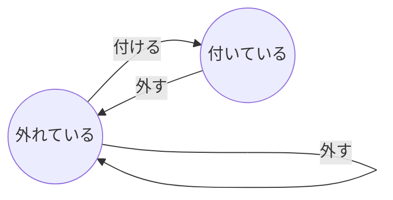

<!-- - 序論
  - Finite automatonとは何か
  - Finite automatonの効能とは？
- 例題
  - Finite automatonを丁寧に書く
  - コードに落とし込む
  - Hands On
    1. 設計
       1. Finite Automaton
       2. 状態遷移表
    2. テストと実装
       1. 最も簡単なテスト
       2. 最小の実装
       3. 三角測量
       4. 一般化
    3. リファクタリング
       1. useReducerを使う
- 結び
  - Finite automatonで見通しの良い設計を与えられる
  - TDDは実装を勧める道具 -->

## お題のストーリー

あなたはブログサービスの開発者です
ユーザーがより個性を表現できるように、称号を自称できる機能を遊び心から思いつきました
暇つぶし程度の思いつきでしたが、無事機能実装をできる段階まで漕ぎ着けました
考えたところ称号は以下のような仕様であるとまとめました

1. ユーザーはいつでも称号を自称できる
2. ユーザーは称号を編集できる
3. ユーザーは称号を外すこともできる
4. 称号は簡単なテキストから構成される

## 設計をしよう

<!-- Finite Automatonを記述する -->
<!-- 状態遷移表を記述する -->
<!-- 状態遷移表がそのままテストになることを指摘する -->
<!-- Clean Craftsmanshipを引用  -->
まずは実装の前に、設計を行うことに異論はないでしょう
ですが、そもそも設計とは何でしょうか
正直なところ明確な答えは持ち合わせておりませんが、少なくとも**実装する対象を正しく、はっきりと、明快に理解する**ことが設計に必要であることにも異論はないでしょう
今回は有限オートマトンを使って、「タグとは何か」を明快に理解して行きます
ところで有限オートマトンとはwikipediaで調べると、次の通りです

> 有限オートマトン（ゆうげんオートマトン、英: finite automaton)または有限状態機械（ゆうげんじょうたいきかい、英: finite state machine, FSM）とは、有限個の状態と遷移と動作の組み合わせからなる数学的に抽象化された「ふるまいのモデル」である。
>
> wikipedia 有限オートマトン[^Finite_Automaton_wikipedia]より引用

これが有限オートマトンの定義ですが、百聞は一見に如かずです
実際に、タグの有限オートマトンを描いてみましょう



テキストのみで、タグとは何かを並べ立てるよりは明快な表現のように与えられたように感じられないでしょうか
実際タグとは何かを説明しようとすると、「タグとは”外れている状態”と”付いている状態”があり、イベントとして”外す”と”付ける”がある。”外す”イベントは...」のように長々となるでしょう
適切なモデリングを選ぶことは、対象を理解することに大いに役に立つのです
さらに有限オートマトンの良いところは、自然に状態遷移表が作れることです
状態遷移表とは、次のような「状態遷移」をテーブルとして表したものです

| 現在の状態 | イベント | 次の状態   |
| ---------- | -------- | ---------- |
| 外れている | 付ける   | 付いている |
| 外れている | 外す     | 外れている |
| 付いている | 外す     | 外れている |

この表をよく見ると、有限オートマトンの矢印を辿ることと同じであることに気づくでしょう
しかしなぜ状態遷移表を得ることが大事なのでしょうか
それは、状態遷移表はそのままテストケースを得られるからです
実際、上記の表の行をつなげると「タグが外れている状態から付けると、タグは付いている」というテストケースを得ることができます
このように、有限オートマトンは簡潔ながらも実装する対象をよく理解できるモデリングです
さらに有限オートマトンについて書籍Clean Craftsmanshipにて、以下のように述べられています

> すべてのテストはシステムの振る舞いを記述する有限状態機械の遷移であると推論できる。（中略）作成しているプログラムが有限状態機械だと知っていただろうか？すべてのプログラムが有限状態機械である。
>
> Clean Craftsmanship 規律、基準、倫理　第3章「テスト駆動開発応用」[^CC]より引用

有限状態機械は、有限オートマトンと同じ意味の言葉でした
著者の言葉を信じるなら、**プログラミングは（たとえ意識しなかったとしても）結果的に有限オートマトンを記述している**のです
もっと言うならばプログラミングと、有限オートマトンの差はプログラミング言語仕様に縛られるかどうかでしょう
言語仕様に縛られないという点で有限オートマトンはシステムの表現として軽く、自由であります
有限オートマトンと上手に付き合うことは、システムが何者であるか、すなわち設計に大いに役に立つのではないでしょうか
（私は、よく頭の中や、ノートに走り書きで有限オートマトンをスケッチしています）

<!-- すなわち著者の言葉を信じるならば、逆もまた正しいということです
これは有限オートマトンは、簡潔ながら強力な設計の道具であると言えるでしょう
テスト駆動開発の設計の定石と言えばTODOリストですが、設計の手札の1つとして有限オートマトンを加えてみてはいかがでしょうか（もちろん両方を織り交ぜるのは大変素晴らしいアイデアです） -->

## 有限オートマトンから型を表現しよう

さて、有限オートマトンを用いることで設計が十分にできたので実装に入る前に型で実装する対象を表現しましょう
型を優先して実装する理由は、次の2つです

1. 型が有限オートマトンと相性が良い
2. 型はランタイムでは存在しないため、実装よりも情報量が小さい

しかし理由の1番目は、状態遷移表がテストケースとなる点からテストコードよりも型を優先する理由となりません
大事なのは理由の2番目です
情報量が小さいことは認知負荷を下げることに繋がります
単純に気をつけるべき点が少ないため、実装時にバグが混入する確率が下がります
早速型の実装に移りましょう
有限オートマトンを元に、型を表現するので再度見直しましょう


タグは`付いている`状態と、`外れている`状態の2種類あります
<!-- 更にタグは`付いている`時だけは`名前`を持ちます -->
<!-- これに基づき、型を与えると以下の通りに -->

```typescript
type DetachedTag = {
  mode: "detached";
};

type AttachedTag = {
  mode: "attached";
  name: string;
};
```

ではタグの型は何かというと、これは次のユニオン型です

```typescript
type Tag = DetachedTag | AttachedTag;
```

次に`useTag`の型を考えましょう
`useTag`は`タグ`、`付ける`、`外す`の3要素を返せばいいでしょう
ですので以下の通りです

```typescript
type useTag = () => {
  tag: Tag;
  attach: (name: string) => void;
  detach: () => void;
};
```

このステップで定義した型を1つにすると、次の通りです

```typescript
type DetachedTag = {
  mode: "detached";
};

type AttachedTag = {
  mode: "attached";
  name: string;
};

type Tag = DetachedTag | AttachedTag;

type useTag = () => {
  tag: Tag;
  attach: (name: string) => void;
  detach: () => void;
};
```

## 実装

型の準備ができたので早速`useTag`の実装に入りましょう
<!-- テスト駆動開発から引用 -->

### 自明な一歩

まず最も簡単なテストを作成します
ところで最も簡単なテストとは、何でしょうか
そもそも今回のテストケースは何でしょうか？
<!-- Clean Craftsmanshipの一文を引用する -->

状態遷移表を再度見直しましょう

| 遷移前               | 状態変化         | 遷移後               |
| -------------------- | ---------------- | -------------------- |
| タグが外れている     | "金"タグを付ける | "金"タグが付いている |
| タグが外れている     | 外す             | タグが外れている     |
| "金"タグが付いている | 外す             | 外れている           |

これらが、そのままテストケースとなります
この中で最も簡単そうなのは、`タグが外れている時に、タグを外す`ことでしょう
早速書いてみましょう
（今回テストフレームワークとして、vitestを利用します）

```typescript
import { test } from "vitest";

test("タグが外れた状態から、外すとタグは外れている", () => {});
```

この時点で、テストを走らせましょう
以下のようにテストに成功するはずです
<!-- テスト結果の画像を載せる -->

さて何もテストコードを書いていないのに、なぜテストを実行したのでしょうか
それはテストフレームワークが正しく起動することを確かめるためです

問題なくテストに成功したら、テストコードの続きを書きましょう
まずは`useTag`を呼び出します

```typescript:useTag.spec.ts
import { expect } from "vitest";
import { renderHook } from "@testing-library/react";
import { useTag } from "./useTag";

test("タグが外れた状態から、外すとタグは外れている", () => {
  renderHook(() => useTag());
}
```

この時点でテストコードを走らせると、失敗します
私の環境では下記のエラーが出力されました
<!-- 画像を挿入 -->

`useTag`がそもそも定義されていませんでしたね
最小のコードでコンパイルエラーを解消しましょう

```typescript:useTag.ts
type DetachedTag = {
  mode: "detached";
};

type AttachedTag = {
  mode: "attached";
  name: string;
};

type Tag = DetachedTag | AttachedTag;

type useTag = () => {
  tag: Tag;
  attach: (name: string) => void;
  detach: () => void;
};

export const useTag: useTag = () => {};
```

実装を追加した後に、テストを実行すると成功します！
しかしこれはとてもひどいコードですね
型エラーもけたたましく鳴り響いています
しかしこれは想定通りであり、テストコードは完成していませんでした
ここで実装を進めることを今回はグッと堪えテストコードに着手しましょう
次は`detach`を実際に呼び出してみましょう

```typescript:useTag.spec.ts
import { expect } from "vitest";
import { renderHook } from "@testing-library/react";
import { useTag } from "./useTag";

test("タグが外れた状態から、外すとタグは外れている", () => {
  const { result } = renderHook(() => useTag());

  result.current.detach();
}
```

この状態でテストを実行すると失敗します
もちろん`detach`というメソッドが`export`されていないからですね
早速実装しましょう

```typescript:useTag.ts
type DetachedTag = {
  mode: "detached";
};

type AttachedTag = {
  mode: "attached";
  name: string;
};

type Tag = DetachedTag | AttachedTag;

type useTag = () => {
  tag: Tag;
  attach: (name: string) => void;
  detach: () => void;
};

export const useTag: useTag = () => {
  const detach = () => {};

  return { detach }
};
```

これでテストがパスします
`detach`もテストを通すためだけのひどいコードですが、実装は後回しにしてテストを完成させましょう

```typescript:useTag.spec.ts
import { expect } from "vitest";
import { renderHook } from "@testing-library/react";
import { useTag } from "./useTag";

test("タグが外れた状態から、外すとタグは外れている", () => {
  const { result } = renderHook(() => useTag());

  result.current.detach();

  expect(result.current.tag).toStrictEqual({
    mode: "detached",
  });
}
```

無事1つのテストケースが完成しました
完成しましたが、これも当然テストに失敗します
`tag`を実装しましょう

```typescript:useTag.ts
type DetachedTag = {
  mode: "detached";
};

type AttachedTag = {
  mode: "attached";
  name: string;
};

type Tag = DetachedTag | AttachedTag;

type useTag = () => {
  tag: Tag;
  attach: (name: string) => void;
  detach: () => void;
};

export const useTag: useTag = () => {
  const tag = { mode: 'detached' }
  const detach = () => {};

  return { tag ,detach }
};
```

これでテストがパスします
パスしますが、ひどいコードですね
少なくとも`tag`はstateであるべきです
ですがここはあえて実装を進めないでもう一個テストケースを追加しようと思います
というのも`useTag`の型エラーを先に解消したいと考えたからです

<!-- テスト駆動開発の十分小さなステップ、ちょうどいいステップを引用し、Tipsにまとめる -->

### attachの実装

<!-- 状態遷移表からテストを作ろう -->
| 遷移前               | 状態変化         | 遷移後               |
| -------------------- | ---------------- | -------------------- |
| タグが外れている     | "金"タグを付ける | "金"タグが付いている |
| タグが外れている     | 外す             | タグが外れている     |
| "金"タグが付いている | 外す             | 外れている           |

早速`attach`を実装しましょう

```typescript:useTag.spec.ts
import { expect } from "vitest";
import { renderHook } from "@testing-library/react";
import { useTag } from "./useTag";

test("タグが外れた状態から、外すとタグは外れている", () => {
  const { result } = renderHook(() => useTag());

  result.current.detach();

  expect(result.current.tag).toStrictEqual({
    mode: "detached",
  });
}

test("タグが外れた状態から、タグをつけると、タグは付いている", () =>{
  const { result } = renderHook(() => useTag());

  result.current.attach("金");
})
```

`attach`が無いとコンパイルエラーが発生していますので、早速実装します

```typescript:useTag.ts
type DetachedTag = {
  mode: "detached";
};

type AttachedTag = {
  mode: "attached";
  name: string;
};

type Tag = DetachedTag | AttachedTag;

type useTag = () => {
  tag: Tag;
  attach: (name: string) => void;
  detach: () => void;
};

export const useTag: useTag = () => {
  const tag = { mode: 'detached' }
  const detach = () => {};
  const attach = (name: string) => {};

  return { tag ,attach ,detach }
};
```

これでテストがパスしました
ではテストを完成させましょう

```typescript:useTag.spec.ts
import { expect } from "vitest";
import { renderHook } from "@testing-library/react";
import { useTag } from "./useTag";

test("タグが外れた状態から、外すとタグは外れている", () => {
  const { result } = renderHook(() => useTag());

  result.current.detach();

  expect(result.current.tag).toStrictEqual({
    mode: "detached",
  });
}

test("タグが外れた状態から、タグをつけると、タグは付いている", () =>{
  const { result } = renderHook(() => useTag());

  result.current.attach("金");

  expect(result.current.tag).toStrictEqual({
    mode: "attached",
    name: "金"
  })
})
```

この状況では、想定通り`tag`の値が一致しないとテストに失敗した原因がわかります
<!-- 画像を撮る -->
`useState`を使って、うまく切り替えられるようにしましょう

```typescript:useTag.ts
import { useState } from 'react';

type DetachedTag = {
  mode: "detached";
};

type AttachedTag = {
  mode: "attached";
  name: string;
};

type Tag = DetachedTag | AttachedTag;

type useTag = () => {
  tag: Tag;
  attach: (name: string) => void;
  detach: () => void;
};

export const useTag: useTag = () => {
  const [tag, setTag] = useState<Tag>({ mode: 'detached' })
  const detach = () => {};
  const attach = (name: string) => {
    setTag({ mode: 'attached', name, })
  };

  return { tag ,attach ,detach }
};
```

さてさて、これで完璧と思いきや、なぜかテストが失敗します
**テストコードもバグが混入する可能性がある**
これは残念ながら、事実です
しかし、これが理由でテストコードが価値を失うとは限りません
というのもバグの混入確率を下げているのもまた事実だからです
**ソフトウェアにバグが存在しないことを証明することは不可能である**というのは真理です
私たちに残された手段は、ただありとあらゆる方法を用いてソフトウェアが価値を産む確率を高めることに尽きます
自動テストは、その確率を向上させる有効な手法の1つであるということが、これまでの研究、開発、といった営みを通じて人類が得たものでしょう
<!-- Tips: あえてテストが失敗する値をコードに書きこみ、予想通りの失敗させる話を書く。詳細は文献[X]と案内する -->

さて本題に戻りましょう
問題は、コードは正しそうなのに何故かテストコードが動作しないことでした
結論から言えば、これは`状態(state)`の更新前に値を検証してしまったからです
Reactの`状態(state)`はsnapshotのようなものでした
<!-- React beta state snapshot renderingを引用する -->
この`状態(state)`の問題を解決するAPIが`testing-library`の`act`です
これを用いて、テストを改善しましょう
<!-- actの仕組みについてのリンクを貼る. -->

```typescript:useTag.spec.ts
import { expect } from "vitest";
import { renderHook, act } from "@testing-library/react";
import { useTag } from "./useTag";

test("タグが外れた状態から、外すとタグは外れている", () => {
  const { result } = renderHook(() => useTag());

  act(() => {
    result.current.detach();
  })

  expect(result.current.tag).toStrictEqual({
    mode: "detached",
  });
}

test("タグが外れた状態から、タグをつけると、タグは付いている", () =>{
  const { result } = renderHook(() => useTag());

  act(() => {
    result.current.attach("金");
  });

  expect(result.current.tag).toStrictEqual({
    mode: "attached",
    name: "金"
  });
})
```

再度テストを走らせてみると、パスします
無事`attach`の実装ができました
この段階でコードを見直してみましょう
ところで`detach`が明らかにバグが発生しそうなひどいコードです
状態遷移表に残っていたテストケースを追加して、正しく動作するコードにしましょう

<!-- 実装 -->

### detach再訪

まずは状態遷移表を振り返りましょう

| 遷移前               | 状態変化         | 遷移後               |
| -------------------- | ---------------- | -------------------- |
| タグが外れている     | "金"タグを付ける | "金"タグが付いている |
| タグが外れている     | 外す             | タグが外れている     |
| "金"タグが付いている | 外す             | 外れている           |

実装に入る前に、最後の行をテストケースとして書き起こしてみましょう

```typescript:useTag.spec.ts
import { expect } from "vitest";
import { renderHook, act } from "@testing-library/react";
import { useTag } from "./useTag";

test("タグが外れた状態から、外すとタグは外れている", () => {
  const { result } = renderHook(() => useTag());

  act(() => {
    result.current.detach();
  })

  expect(result.current.tag).toStrictEqual({
    mode: "detached",
  });
}

test("タグが外れた状態から、タグをつけると、タグは付いている", () =>{
  const { result } = renderHook(() => useTag());

  act(() => {
    result.current.attach("金");
  });

  expect(result.current.tag).toStrictEqual({
    mode: "attached",
    name: "金"
  });
})

test("タグが付いている状態から、タグを外すと、タグは外れている", () =>{
  // Arrange
  const { result } = renderHook(() => useTag());

  act(() => {
    result.current.attach("金");
  });

  // Act
  act(() => {
    result.current.detach();
  });

  // Assert
  expect(result.current.tag).toStrictEqual({ mode: "detached" });
})
```

:::message
コードコメント内で、いわゆるAAAパターンを実施しました
AAAとは、Arrange（準備）、Act（実行）、Assert（検証）の頭文字を取ったテストコードの設計パターンです
詳細は`XXXX`を参照してください
:::
<!-- Tips AAAパターンを説明する。単体テストの使い方/考え方を紹介する -->
想定通りテストは失敗します
テストが通るように、`detach`を修正しましょう

```typescript:useTag.ts
import { useState } from 'react';

type DetachedTag = {
  mode: "detached";
};

type AttachedTag = {
  mode: "attached";
  name: string;
};

type Tag = DetachedTag | AttachedTag;

type useTag = () => {
  tag: Tag;
  attach: (name: string) => void;
  detach: () => void;
};

export const useTag: useTag = () => {
  const [tag, setTag] = useState<Tag>({ mode: 'detached' })
  const detach = () => { setTag({ mode: "detached" }) };
  const attach = (name: string) => {
    setTag({ mode: 'attached', name, })
  };

  return { tag, attach, detach }
};
```

テストを走らせると、パスしました！
これで状態遷移表にある全てのケースをテストコードとして実現でき、コードの実装もできました
これで万々歳です
しかしテスト駆動開発の黄金のサイクルのうち、重要なステップであるリファクタリングに言及していませんでした
改めてリファクタリングを一言で述べると、**コードの振る舞いを変えずに、コードを改善すること**です
しかし、この定義は**コードの振る舞い**という言葉が些か曖昧です
良い自動テストが用意されている時は、リファクタリングの定義を次のように言い換えられます
**自動テストを成功させたまま、コードを改善すること**
<!-- この言葉をテスト駆動開発から引用する -->
この定義に言い換えられるのは、良い自動テストがコードの振る舞いを捕捉するからです
この定義は大変強力です
というのも、**コードの振る舞い**という曖昧なものではなく、テストコードというプレーンテキストと、テストの成功または失敗という単純な2値に置き換えられるからです
これは曖昧な言葉よりもずっと解析可能な対象です
実際プレーンテキストなら種々のプログラミング原理、原則が適応可能であり、単純な2値なら判断は明確です
**コードの振る舞い**を可視化するというのも自動テストの功の1つでしょう
次のステップでは実際にリファクタリングをしてみましょう
<!-- バグを起こす -->

## リファクタリング

まずは現在のコードを見返しましょう

```typescript:useTag.ts
import { useState } from 'react';

type DetachedTag = {
  mode: "detached";
};

type AttachedTag = {
  mode: "attached";
  name: string;
};

type Tag = DetachedTag | AttachedTag;

type useTag = () => {
  tag: Tag;
  attach: (name: string) => void;
  detach: () => void;
};

export const useTag: useTag = () => {
  const [tag, setTag] = useState<Tag>({ mode: 'detached' })
  const detach = () => { setTag({ mode: "detached" }) };
  const attach = (name: string) => {
    setTag({ mode: 'attached', name, })
  };

  return { tag,　attach,　detach }
};
```

このコードをより明瞭にできないか考えてみます
このコードを書いているときに私は違和感を感じていました
それは`attach`と`detach`になぜタグの型情報が表現されていないのかということです
実際に、`attach`と`detach`の型情報を見返すと次の通りです

```typescript
type useTag = () => {
  tag: Tag;
  attach: (name: string) => void;
  detach: () => void;
};
```

`attach`と`detach`が`void`を返しています
`void`を返していると言うことは、何らかの副作用が生じるコードを表しています
副作用は取り扱いが難しくバグの温床となりやすいということはよく知られていることでしょう
次のように、タグの情報を返り値に与えれば状態（state）が更新される仕組みだったらコンパイルエラーでもコードが正しく振る舞う確率を上げられるのではないのでしょうか

```typescript
type useTag = () => {
  tag: Tag;
  attach: (name: string) => AttachedTag;
  detach: () => DetachedTag;
};
```

これはもちろん疑似コードであり、状態（state）の更新はReactの仕事のため動作しません
しかしちょうどいい解決方法がReactから提供されています
それは`useReducer`です
<!-- `useReducer`について簡単に述べる -->
`reducer`周りの実装をする前に、型で実装したい事柄を表現しましょう
まずは`reducer`のアクションを型で表現します
`attach`と`detach`という2種類のアクションを持つので、`reducer`のアクションタイプはこのようになるでしょう

```typescript
type AttachAction = { type: 'attach', name: string};
type DetachAction = { type: 'detach'};
type Action = AttachAction | DetachAction;
```

次は`reducer`の型を用意しましょう
さらに`reducer`内部ではアクションタイプに応じて`attach`と`detach`を呼ぶ設計にします

```typescript
type AttachAction = { type: 'attach', name: string};
type DetachAction = { type: 'detach'};
type Action = AttachAction | DetachAction;

type AttachInReducer = (name: string) => AttachedTag;
type DetachInReducer = () => DetachedTag;
type Reducer = (tag: Tag, type: ActionType) => Tag;
```

この型に基づいて、実装してみましょう

```typescript
type AttachAction = { type: 'attach', name: string};
type DetachAction = { type: 'detach'};
type Action = AttachAction | DetachAction;

type AttachInReducer = (name: string) => AttachedTag;
type DetachInReducer = () => DetachedTag;
type Reducer = (tag: Tag, type: ActionType) => Tag;

const attachInReducer: AttachInReducer = (name) => ({ mode: 'attached', name });
const detachInReducer: DetachedInReducer = () => ({ mode: 'detached' });
const reducer: Reducer = (_, type) => {
  switch (action.type) {
    case "attach":
      return attachInReducer(action.name);
    case "detach":
      return detachInReducer();
    default:
      throw new Error("invalid action");
}
```

このreducerを使って、リファクタリングをやってみましょう

```typescript:useTag.ts
import { useReducer } from "react";

type DetachedTag = {
  mode: "detached";
};

type AttachedTag = {
  mode: "attached";
  name: string;
};

type Tag = DetachedTag | AttachedTag;

type useTag = () => {
  tag: Tag;
  attach: (name: string) => void;
  detach: () => void;
};

type AttachAction = { type: "attach"; name: string };
type DetachAction = { type: "detach" };
type Action = AttachAction | DetachAction;
type AttachInReducer = (name: string) => AttachedTag;
type DetachInReducer = () => DetachedTag;
type Reducer = (tag: Tag, action: Action) => Tag;

const attachInReducer: AttachInReducer = (name) => ({ mode: "attached", name });
const detachInReducer: DetachInReducer = () => ({ mode: "detached" });
const reducer: Reducer = (_, action) => {
  switch (action.type) {
    case "attach":
      return attachInReducer(action.name);
    case "detach":
      return detachInReducer();
    default:
      throw new Error("invalid action");
  }
};

export const useTag: useTag = () => {
  const [tag, dispatch] = useReducer(reducer, { mode: "detached" });

  const attach = (name: string) => dispatch({ type: "attach", name });

  const detach = () => dispatch({ type: "detach" });

  return { tag, attach, detach };
};
```

最後に、テストを走らせましょう
パスしました！これでリファクタリングが完了です！

最後にリファクタリングのきっかけを振り返りましょう
リファクタリングの糸口は、タグの操作である`attach`と`detach`にタグの情報が型の世界では欠落していることへの違和感でした
ではなぜ違和感を感じられたのかを掘り下げると、参考文献[^DMMF][^DMMF_2022][^バックエンド再考]にてドメインを型で表現する考え方を学べていたからです
ではなぜこれら参考文献に出会えたのかというと、それは単なる偶然です
結局のところコード設計のひらめきは偶然の産物です
ですが、このことに落胆する必要はありません
書籍「テスト駆動開発」[^TDD]の言葉を紹介します

> TDDは、設計のひらめきが正しい瞬間に訪れることを保証するものではない。しかし、自信を与えてくれるテストときちんと手入れされたコードは、ひらめきへの備えであり、いざひらめいたときに、それを具現化するための備えでもある
>
> テスト駆動開発[^TDD] 第12章「式とメタファー」より引用

この書籍を読んだ多くの方が、この言葉が好きだと勝手に思っています
もちろん私もこの言葉が好きです
ひらめきをコードに反映できたのは、きちんと備えていたからでしょう
つまり学んだことを実際に使える喜びをテスト駆動開発は与えてくれるというのは大袈裟な表現かもしれません
ですが、その喜びに出会う確率を向上させることには役に立つでしょう

<!-- 状態を確認するテストであることを指摘する -->
<!-- 状態を確認するテストは単体テストの使い方・考え方より引用 -->

## 結び

<!-- 実際のコードはここまで型の設計がうまくいかないことは多い→テスト駆動開発とうでより書籍を読もう -->
<!-- テストはソフトウェアの質を向上させない、質を把握するだけ→コード設計の本を読む -->
<!-- テストそのものの考え方・使い方は良いだろうか？→単体テストの使い方・考え方で単体テストもプロダクションコードの意識を学ぼう -->
<!-- テストケースは十分だったか？テスト設計の本を紹介する -->
<!-- 自動テストは世界を広げる→フィードバックが得られる特性→色々な技術への興味が持てるかも？ -->

## 参考文献

[^DMMF]: [Scott Wlaschin. Domain Modeling Made Functional. Pragmatic Bookshelf, 2018.](https://pragprog.com/titles/swdddf/domain-modeling-made-functional/)
[^TDD]: [Kent Beck 著 和田卓人訳. テスト駆動開発. オーム社, 2017.](https://shop.ohmsha.co.jp/shopdetail/000000004967/)
[^UTP3]: [Vladimir Khorikov 著 須田智之編. 単体テストの考え方/使い方. マイナビ出版, 2022.](https://book.mynavi.jp/ec/products/detail/id=134252)
[^CC]: [Robert C. Martin 著 角 征典訳. Clean Craftsmanship 規律、基準、倫理. KADOKAWA, 2022.](https://www.kadokawa.co.jp/product/302206001224/)
[^DMMF_2022]: [Scott Wlaschin. Domain Modeling Made Functional, DevTernity 2022.](https://www.slideshare.net/ScottWlaschin/domain-modeling-made-functional-devternity-2022)
[^バックエンド再考]: [伊藤 直也. フロントエンドのパラダイムを参考にバックエンド開発を再考する/ TypeScript による GraphQL バックエンド開発, 2022.](https://speakerdeck.com/naoya/typescript-niyoru-graphql-batukuendokai-fa)
[^Finite_Automaton_wikipedia]: [有限オートマトン, wikipedia](https://ja.wikipedia.org/wiki/%E6%9C%89%E9%99%90%E3%82%AA%E3%83%BC%E3%83%88%E3%83%9E%E3%83%88%E3%83%B3#:~:text=%E6%9C%89%E9%99%90%E3%82%AA%E3%83%BC%E3%83%88%E3%83%9E%E3%83%88%E3%83%B3%EF%BC%88%E3%82%86%E3%81%86%E3%81%92%E3%82%93%E3%82%AA%E3%83%BC%E3%83%88%E3%83%9E%E3%83%88%E3%83%B3%E3%80%81%E8%8B%B1,%E3%81%B5%E3%82%8B%E3%81%BE%E3%81%84%E3%81%AE%E3%83%A2%E3%83%87%E3%83%AB%E3%80%8D%E3%81%A7%E3%81%82%E3%82%8B%E3%80%82)
